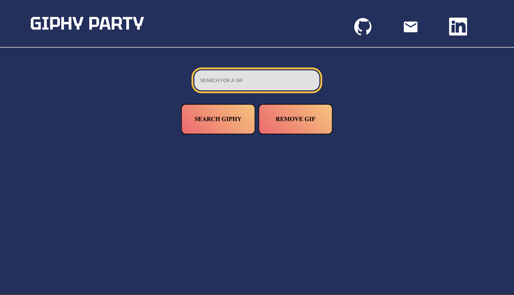

<!-- PROJECT LOGO -->
 

  
  <h3 align="center">GIPHY PARTY</h3>

  

    A Search Engine Built For Searching Gifs! "GIPHY PARTY" Allows Users to Search For Thousands Upon Thousands of Gifs Based on Their Emotion and Event!
     
    <a href="https://giphy-party.hasanabdulla.repl.co/"><strong>HOME PAGE</strong></a>
  

<!-- TABLE OF CONTENTS -->

  
Table of Contents

  <ol>
    <li>
      <a href="#about-the-project">About The Project</a>
    </li>
    <li><a href="#contact">Contact</a></li>
  </ol>

<!-- ABOUT THE PROJECT -->
## About The Project

The GIPHY Party Was Designed To Assist Users With Finding Gifs and Being Able to Use Such Gifs Across Any Social Media Platform Ever! "GIPHY Party" Was Designed to Be Easily Accesible for All and Easy to Use :)

<!-- CONTACT -->
## Contact

[Hasan Abdulla](https://www.linkedin.com/in/hasan-abdulla1903/) - ishabdulla26@gmail.com

Project Link: [https://github.com/hAbdulla19/GIPHY-PARTY](https://giphy-party.hasanabdulla.repl.co/)

## Contributors

- Vidhi Kokel: Software Developer (Email: vidhikokel@gmail.com)
